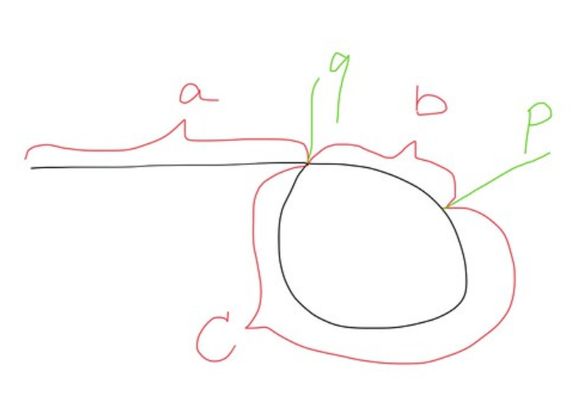

# Leetcode stuff (Actual Leetcode Qs)

### find the first non repeated character of a given string

```cpp
class Solution {
public:
    int firstUniqChar(string s) {
        std::unordered_map<char, int> counts;
        for (char c : s) {
            ++counts[c];
        }

        for (int i = 0; i < s.size(); ++i) {
            if (counts[s[i]] == 1) return i;
        }

        return -1;
    }
};
```

### find duplicate numbers in an array (if it contains multiple duplicates)

```cpp
class Solution {
public:
    vector<int> findDuplicates(vector<int>& nums) {
        std::vector<int> result;

        // 4 3 2 7 8 2 3 1
        // index=3, nums[index]=7
        // 4 3 2 -7 8 2 3 1
        // index=2, nums[index]=2
        // 4 3 -2 -7 8 2 3 1
        // index=1, nums[index]=3
        // 4 -3 -2 -7 8 2 3 1
        // index=6, nums[index]=3
        // 4 -3 -2 -7 8 2 -3 1
        // index=7, nums[index]=2
        // 4 -3 -2 -7 8 2 -3 -1
        // index=1, nums[index]=-3
        // 
        for (int num : nums) {
            int index = abs(num) - 1;
            if (nums[index] < 0) {
                result.push_back(abs(num));
            } else {
                nums[index] = -nums[index];
            }
        }
        
        return result;
    }
};
```

### remove duplicates from an array in place

```cpp
class Solution {
public:
    int removeDuplicates(vector<int>& nums) {
        int index = 1;

        for (int i = 1; i < nums.size(); ++i) {
            if (nums[i] != nums[i - 1]) {
                nums[index] = nums[i];
                ++index;
            }
        }

        return index;
    }
};
```

### find the middle element of a singly linked list

```cpp
class Solution {
public:
    ListNode* middleNode(ListNode* head) {
        ListNode* slow = head;
        ListNode* fast = head;

        while (fast and fast->next) {
            // std::cout << slow->val << ", " << fast->val << std::endl;
            slow = slow->next;
            fast = fast->next->next;
        }
        
        return slow;
    }
};
```

### check if a given linked list contains a cycle

```cpp
class Solution {
public:
    bool hasCycle(ListNode* head) {
        ListNode* slow = head;
        ListNode* fast = head;

        while (fast and fast->next) {
            slow = slow->next;
            fast = fast->next->next;

            if (slow == fast) return true;
        }

        return false;
    }
};
```

### find the entry of the cycle



slow = `a + b`
fast = `a + b + c + b`

`2(a + b) = a + 2b + c`

therefore, distance-wise `a = c`

if we start all over again from head & curr slow, we can find the entry point of the cycle.

```cpp
class Solution {
public:
    ListNode *detectCycle(ListNode *head) {
        ListNode* slow = head;
        ListNode* fast = head;

        while (fast and fast->next) {
            slow = slow->next;
            fast = fast->next->next;

            if (slow == fast) {
                slow = head;

                while (slow != fast) {
                    slow = slow->next;
                    fast = fast->next;
                }

                return slow;
            }
        }

        return nullptr;
    }
};
```

### reverse a singly linked list without recursion

```cpp
class Solution {
public:
    ListNode* reverseList(ListNode* head) {
        ListNode* prev = nullptr;
        ListNode* curr = head;
        ListNode* next;

        while (curr) {
            next = curr->next;
            curr->next = prev;
            prev = curr;
            curr = next;
        }

        return prev;
    }
};
```

### traverse a given binary tree in preorder without recursion

```cpp
class Solution {
public:
    vector<int> preorderTraversal(TreeNode* root) {
        std::vector<int> result;

        if (not root) return result;

        std::stack<TreeNode*> nodes;
        nodes.push(root);

        while (not nodes.empty()) {
            TreeNode* curr = nodes.top();
            nodes.pop();
            result.push_back(curr->val);

            // Push right first so that left is processed first
            if (curr->right) nodes.push(curr->right);
            if (curr->left) nodes.push(curr->left);
        }

        return result;
    }
};
```

### traverse a given binary tree in inorder without recursion

```cpp
class Solution {
public:
    vector<int> inorderTraversal(TreeNode* root) {
        std::stack<TreeNode*> nodes;
        TreeNode* curr = root;
        std::vector<int> result;

        while (not nodes.empty() or curr) {
            while (curr) {
                nodes.push(curr);
                curr = curr->left;
            }

            curr = nodes.top();
            nodes.pop();

            result.push_back(curr->val);
            // curr = nodes.top();
            curr = curr->right;
        }

        return result;
    }
};
```

### traverse a given binary tree in postorder without recursion

```cpp
std::vector<int> postorderTraversal(TreeNode* root) {
    std::vector<int> result;
    if (!root) return result;

    std::stack<TreeNode*> stk;
    stk.push(root);

    // Postorder is Left -> Right -> Root
    // If we do Root -> Right -> Left, then reverse
    // We can get postorder traversal

    while (!stk.empty()) {
        TreeNode* node = stk.top();
        stk.pop();

        result.push_back(node->val); // Process root

        // Push left first, then right (so right is processed first)
        if (node->left) stk.push(node->left);
        if (node->right) stk.push(node->right);
    }

    // Reverse the result to get Left -> Right -> Root
    std::reverse(result.begin(), result.end());
    return result;
}
```

# Non-leetcode stuff

### How is a bubble sort algorithm implemented?

- Repeatedly swap adjacent elements if they are in the wrong order. 
- Largest elements "bubble" to the end.

```cpp
void bubbleSort(std::vector<int>& arr) {
    int n = arr.size();
    bool swapped;

    for (int i = 0; i < n - 1; ++i) {
        swapped = false;

        for (int j = 0; j < n - i - 1; ++j) {
            if (arr[j] > arr[j + 1]) {
                std::swap(arr[j], arr[j + 1]);
                swapped = true;
            }
        }

        if (!swapped) break; // No swaps ⇒ already sorted
    }
}
```

### How is a merge sort algorithm implemented?

- Divide array into halves
- Recursively sort each half
- Merge two sorted halves into one

```cpp
void merge(std::vector<int>& arr, int left, int mid, int right) {
    std::vector<int> temp;
    int i = left, j = mid + 1;

    while (i <= mid and j <= right) {
        if (arr[i] <= arr[j]) temp.push_back(arr[i++]);
        else temp.push_back(arr[j++]);
    }

    while (i <= mid) temp.push_back(arr[i++]);
    while (j <= right) temp.push_back(arr[j++]);

    for (int k = 0; k < temp.size(); ++k) arr[left + k] = temp[k];
}

void mergeSort(std::vector<int>& arr, int left, int right) {
    if (left >= right) return;

    int mid = (left + right) / 2;

    mergeSort(arr, left, mid);
    mergeSort(arr, mid + 1, right);
    merge(arr, left, mid, right);
}
```

### How is a radix sort algorithm implemented?

```cpp
int getMax(const std::vector<int>& arr) {
    int mx = arr[0];
    for (int num : arr) mx = std::max(mx, num);
    return mx;
}

void countingSortByDigit(std::vector<int>& arr, int exp) {
    int n = arr.size();
    std::vector<int> output(n);
    int count[10] = {0};

    // Count digits
    for (int num : arr)
        count[(num / exp) % 10]++;

    // Make count[i] the position of this digit
    for (int i = 1; i < 10; ++i)
        count[i] += count[i - 1];

    // Build output array (stable sort)
    for (int i = n - 1; i >= 0; --i) {
        int digit = (arr[i] / exp) % 10;
        output[--count[digit]] = arr[i];
    }

    // Copy back
    for (int i = 0; i < n; ++i)
        arr[i] = output[i];
}

void radixSort(std::vector<int>& arr) {
    int maxNum = getMax(arr);

    for (int exp = 1; maxNum / exp > 0; exp *= 10)
        countingSortByDigit(arr, exp);
}
```

### How do you swap two numbers without using the third variable?

Arithmetic Swap

```cpp
int main() {
    int a = 2, b = 3;

    a = a + b;
    b = a - b;
    a = a - b;
}
```

Bitwise Swap

```cpp
int main() {
    int a = 2, b = 3;
    
    a = a ^ b; // a = A ^ B
    b = a ^ b; // b = (A ^ B) ^ B = A
    a = a ^ b; // a = (A ^ B) ^ A = B
}
```

### How is a binary search tree implemented?

- Left child < Node < Right child
- All nodes in the left subtree have values less than the node
- All nodes in the right subtree have values greater than the node

Inserting
```cpp
TreeNode* insert(TreeNode* root, int key) {
    if (!root) return new TreeNode(key);

    if (key < root->val) root->left = insert(root->left, key);
    else if (key > root->val) root->right = insert(root->right, key);
    
    return root;
}
```

### Extra: Deleting from a Binary Tree

```cpp
/**
 * Definition for a binary tree node.
 * struct TreeNode {
 *     int val;
 *     TreeNode *left;
 *     TreeNode *right;
 *     TreeNode() : val(0), left(nullptr), right(nullptr) {}
 *     TreeNode(int x) : val(x), left(nullptr), right(nullptr) {}
 *     TreeNode(int x, TreeNode *left, TreeNode *right) : val(x), left(left), right(right) {}
 * };
 */
class Solution {
public:
    void deletion(TreeNode*& node, int key) {
        if (not node) return;

        if (node->val > key) {
            // Look at left
            deletion(node->left, key);
        } else if (node->val < key) {
            // Look at right
            deletion(node->right, key);
        } else {
            // Node found
            if (not node->left and not node->right) {
                // Leaf node
                node = nullptr;
            } else if (not node->left) {
                // No left node found
                node = node->right;
            } else if (not node->right) {
                // No right node found
                node = node->left;
            } else {
                // Replace with inorder successor (smallest in right subtree)
                TreeNode* succ = node->right;
                while (succ->left) {
                    succ = succ->left;
                }
                node->val = succ->val;

                deletion(node->right, succ->val);
            }
        }
    }

    TreeNode* deleteNode(TreeNode* root, int key) {
        deletion(root, key);
        return root;
    }
};
```

### How do you design a vending machine?

```cpp
class Item {
    std::string name;
    double price;
    int quantity;
};

class InventoryManager {
    std::unordered_map<int, Item> items;
public:
    bool isAvailable(int code);
    void dispenseItem(int code);
    void restock(int code, int quantity);
};

class PaymentProcessor {
    double insertedAmount;
public:
    void insertCoin(double value);
    bool isPaymentSufficient(double price);
    double calculateChange(double price);
};

class VendingMachine {
    InventoryManager inventory;
    PaymentProcessor payment;
public:
    void selectItem(int code);
    void insertCoin(double value);
    void cancel();
};
```

### Difference between a stable and unstable sorting algorithm?

- Preserves the relative order of equal elements
- May change the order of equal elements

### What is the difference between Comparison and Non-Comparison Sorting Algorithms?

- Sorts by comparing elements using <, >, etc.
- Sorts by transforming data (e.g., digits, characters)
